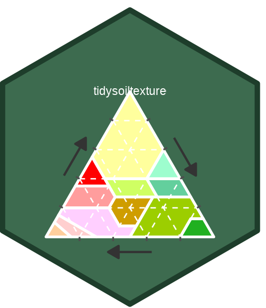

# tidysoiltexture 

<!-- badges: start -->
[](https://lifecycle.r-lib.org/articles/stages.html#stable)
[](https://github.com/Taakefyrsten/tidysoiltexture/actions/workflows/R-CMD-check.yaml)
<!-- badges: end -->

Tidy tools for **soil texture classification** and **ternary visualisation**.
Pipe-compatible functions that accept and return tibbles, with tidy evaluation
support for sand/silt/clay column arguments. Classifies samples to 12 USDA
texture classes and plots publication-ready texture triangles via ggplot2.

## Installation

```r
# Install from GitHub:
pak::pak("Taakefyrsten/tidysoiltexture")
```

## Quick start

```r
library(tidysoiltexture)
library(tibble)

soils <- tribble(
  ~id,   ~sand, ~silt, ~clay,
  "A",      65,    20,    15,
  "B",      20,    50,    30,
  "C",       8,    72,    20,
  "D",      40,    38,    22
)

# Classify texture
classify_texture(soils, sand, silt, clay)
#> # A tibble: 4 × 6
#>   id     sand  silt  clay .texture_class .texture_abbr
#>   <chr> <dbl> <dbl> <dbl> <chr>          <chr>
#> 1 A        65    20    15  sandy loam     SaLo
#> 2 B        20    50    30  clay loam      ClLo
#> 3 C         8    72    20  silty loam     SiLo
#> 4 D        40    38    22  loam           Lo

# Plot the texture triangle
gg_texture_triangle(soils, sand, silt, clay, colour = id)
```

## Spatial workflows

`classify_texture()` dispatches automatically on `sf` point objects and
`terra` SpatRaster stacks — no extra code needed:

```r
# sf point object
library(sf)
pts_sf <- st_as_sf(soils_with_coords, coords = c("lon", "lat"), crs = 4326)
classify_texture(pts_sf, sand = sand, silt = silt, clay = clay)

# terra SpatRaster (e.g. from SoilGrids — divide by 10 to convert g/kg to %)
library(terra)
r <- rast("soilgrids_sand_silt_clay.tif")
r_class <- classify_texture(r / 10, sand = "sand", silt = "silt", clay = "clay")
```

## Performance

| Task | Time |
|------|------|
| Classify 10 000 samples | < 0.015 s |
| Classify 1 000 000 raster cells | < 5 s |

The vectorised backend iterates over 12 USDA polygon classes, testing all N
points per class simultaneously — no row-level R loops.

## Learn more

* `vignette("classify-texture")` — all dispatch methods, edge cases, performance
* `vignette("gg-texture-triangle")` — full styling reference
* `vignette("gis-workflow")` — sf and terra integration

Full documentation: <https://taakefyrsten.github.io/tidysoiltexture>
