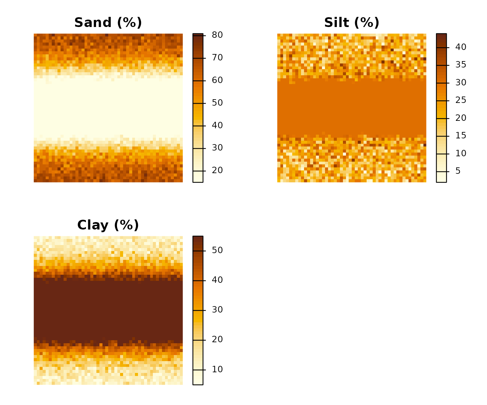
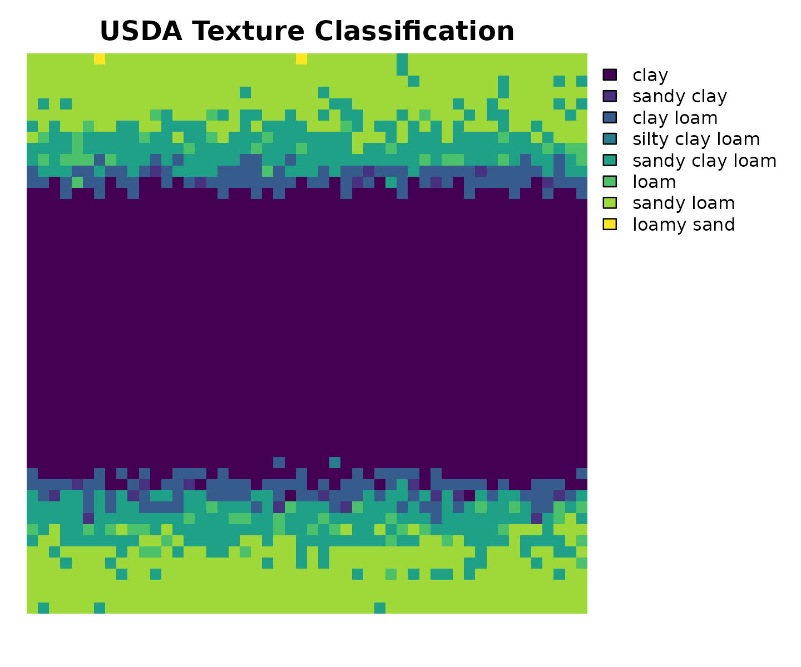
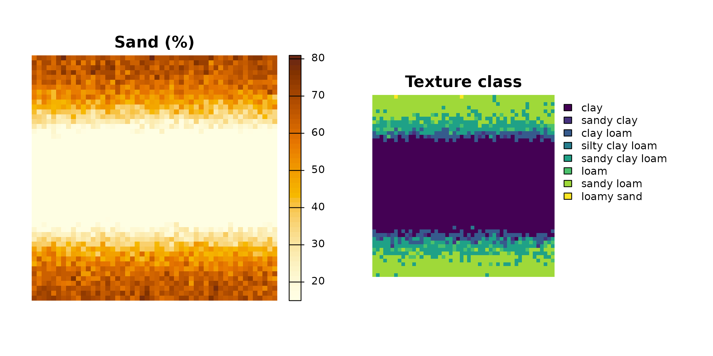
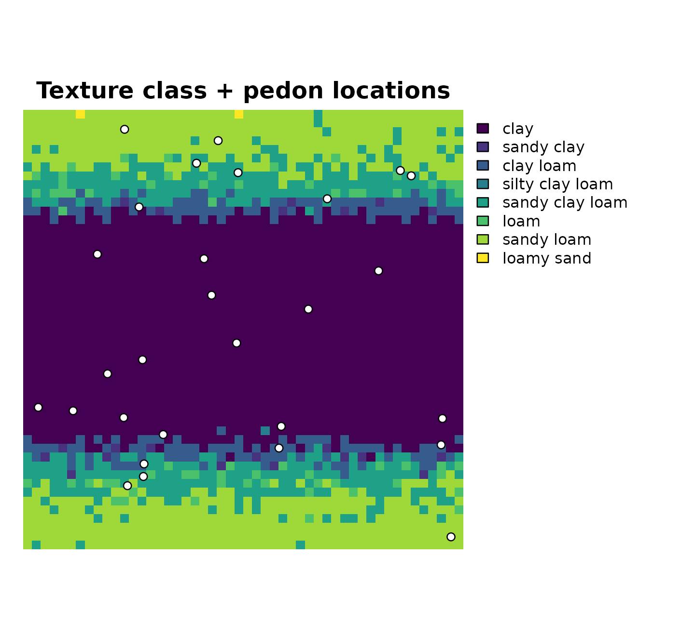

# GIS Workflow: Classifying Raster and Vector Soil Data

As R-GIS workflows become more common in soil science, `tidysoiltexture`
provides
[`classify_texture()`](https://taakefyrsten.github.io/tidysoiltexture/reference/classify_texture.md)
methods for two key spatial classes:

- **[`terra::SpatRaster`](https://rspatial.github.io/terra/reference/SpatRaster-class.html)**
  — classify every cell of a sand/silt/clay raster stack and return a
  categorical output raster suitable for mapping and export.
- **`sf`** — classify point features (e.g. field observations, pedon
  locations) and return the same `sf` object with texture class columns
  appended.

``` r
library(tidysoiltexture)
```

> **`terra`** and **`sf`** are suggested dependencies. Install them with
> `install.packages(c("terra", "sf"))` to follow the full workflow.

------------------------------------------------------------------------

## 1. Raster workflow with `terra`

### 1.1 Load a sand / silt / clay raster stack

In practice your raster stack typically comes from a downloaded product
such as [SoilGrids](https://soilgrids.org) or
[ESDAC](https://esdac.jrc.ec.europa.eu). The only requirement is that
the `SpatRaster` has named layers for sand, silt, and clay (in %).

``` r
library(terra)

# Load a 3-band GeoTIFF where bands are named sand, silt, clay
r <- terra::rast("path/to/soil_texture_stack.tif")

# Rename layers if needed
names(r) <- c("sand", "silt", "clay")

# Inspect
print(r)
terra::plot(r, main = c("Sand (%)", "Silt (%)", "Clay (%)"))
```

For this vignette we build a synthetic stack that mimics a 20 × 20 km
catchment with a sandy upland area and a clay-rich valley floor:

``` r
library(terra)
#> terra 1.9.11

set.seed(1847)

# 50 × 50 cell grid, 400 m resolution, EPSG:32632 (UTM zone 32N)
r_template <- terra::rast(
  nrows = 50, ncols = 50,
  xmin = 0, xmax = 20000,
  ymin = 0, ymax = 20000,
  crs  = "EPSG:32632"
)

# Simulate a north–south valley: clay increases toward centre column
col_idx  <- terra::colFromX(r_template, terra::xFromCol(r_template,
                              seq_len(terra::ncol(r_template))))
valley   <- dnorm(seq(0, 1, length.out = terra::ncol(r_template)),
                  mean = 0.5, sd = 0.18)
valley_m <- matrix(rep(valley, each = terra::nrow(r_template)),
                   nrow = terra::nrow(r_template))

# Sand decreases toward valley; clay increases
sand_m <- pmax(15, pmin(85, 70 - 45 * valley_m +
               matrix(rnorm(2500, 0, 5), 50, 50)))
clay_m <- pmax(5,  pmin(55, 10 + 40 * valley_m +
               matrix(rnorm(2500, 0, 4), 50, 50)))
silt_m <- 100 - sand_m - clay_m

# Force silt ≥ 2 (push excess into sand)
excess <- pmin(0, silt_m - 2)
sand_m <- sand_m + excess
silt_m <- silt_m - excess

# Assemble into SpatRaster
r <- c(terra::setValues(r_template, sand_m),
       terra::setValues(r_template, silt_m),
       terra::setValues(r_template, clay_m))
names(r) <- c("sand", "silt", "clay")

print(r)
#> class       : SpatRaster 
#> size        : 50, 50, 3  (nrow, ncol, nlyr)
#> resolution  : 400, 400  (x, y)
#> extent      : 0, 20000, 0, 20000  (xmin, xmax, ymin, ymax)
#> coord. ref. : WGS 84 / UTM zone 32N (EPSG:32632) 
#> source(s)   : memory
#> names       :     sand,   silt, clay 
#> min values  : 15.00000,  2.000,    5 
#> max values  : 80.93731, 43.958,   55
```

### 1.2 Inspect the stack

``` r
terra::summary(r)
#>       sand            silt            clay      
#>  Min.   :15.00   Min.   : 2.00   Min.   : 5.00  
#>  1st Qu.:15.00   1st Qu.:20.79   1st Qu.:20.06  
#>  Median :33.11   Median :28.28   Median :42.67  
#>  Mean   :36.85   Mean   :25.26   Mean   :37.89  
#>  3rd Qu.:58.54   3rd Qu.:30.00   3rd Qu.:55.00  
#>  Max.   :80.94   Max.   :43.96   Max.   :55.00
terra::plot(r,
  main      = c("Sand (%)", "Silt (%)", "Clay (%)"),
  col       = grDevices::hcl.colors(50, "YlOrBr", rev = TRUE),
  axes      = FALSE
)
```



### 1.3 Classify

Pass the `SpatRaster` directly to
[`classify_texture()`](https://taakefyrsten.github.io/tidysoiltexture/reference/classify_texture.md).
The `sand`, `silt`, and `clay` arguments name the layers (default
`"sand"`, `"silt"`, `"clay"` so they can be omitted here):

``` r
r_class <- classify_texture(r)   # layer names match defaults
print(r_class)
#> class       : SpatRaster 
#> size        : 50, 50, 1  (nrow, ncol, nlyr)
#> resolution  : 400, 400  (x, y)
#> extent      : 0, 20000, 0, 20000  (xmin, xmax, ymin, ymax)
#> coord. ref. : WGS 84 / UTM zone 32N (EPSG:32632) 
#> source(s)   : memory
#> categories  : texture_class 
#> name        : texture_class 
#> min value   :          clay 
#> max value   :    loamy sand
```

The output is a single-layer categorical `SpatRaster`. Integer cell
values are mapped to texture class names via a raster attribute table
(RAT):

``` r
terra::levels(r_class)[[1]]
#>    id   texture_class
#> 1   1            clay
#> 2   2      silty clay
#> 3   3      sandy clay
#> 4   4       clay loam
#> 5   5 silty clay loam
#> 6   6 sandy clay loam
#> 7   7            loam
#> 8   8      silty loam
#> 9   9      sandy loam
#> 10 10            silt
#> 11 11      loamy sand
#> 12 12            sand
```

Count how many cells fall into each class:

``` r
terra::freq(r_class) |>
  dplyr::arrange(dplyr::desc(count))
#>   layer           value count
#> 1     1            clay  1297
#> 2     1      sandy loam   597
#> 3     1 sandy clay loam   350
#> 4     1       clay loam   167
#> 5     1            loam    65
#> 6     1      sandy clay    21
#> 7     1      loamy sand     2
#> 8     1 silty clay loam     1
```

### 1.4 Plot the classified raster

[`terra::plot()`](https://rspatial.github.io/terra/reference/plot.html)
recognises categorical rasters and automatically draws a colour legend:

``` r
terra::plot(r_class,
  main  = "USDA Texture Classification",
  axes  = FALSE,
  mar   = c(2, 1, 2, 8)   # extra right margin for legend
)
```



Side-by-side with the sand layer to confirm the spatial pattern:

``` r
oldpar <- par(mfrow = c(1, 2), mar = c(1, 1, 2, 6))

terra::plot(r[["sand"]],
  main = "Sand (%)",
  col  = grDevices::hcl.colors(50, "YlOrBr", rev = TRUE),
  axes = FALSE)

terra::plot(r_class,
  main = "Texture class",
  axes = FALSE,
  mar  = c(1, 1, 2, 10))
```



``` r

par(oldpar)
```

### 1.5 Export the classified raster

The output is a standard `SpatRaster` and can be written to any
GDAL-supported format. For GeoTIFF:

``` r
terra::writeRaster(r_class, "texture_classification.tif",
                   datatype = "INT1U", overwrite = TRUE)
```

------------------------------------------------------------------------

## 2. Vector workflow with `sf`

For point observations (e.g. soil survey pedons, lab samples with
coordinates) the `sf` method appends `.texture_class` and
`.texture_abbr` while preserving geometry:

``` r
library(sf)
#> Linking to GEOS 3.12.1, GDAL 3.8.4, PROJ 9.4.0; sf_use_s2() is TRUE

# 30 synthetic pedon locations across the study area
set.seed(3312)
pedons <- sf::st_as_sf(
  data.frame(
    pedon_id = sprintf("P%02d", 1:30),
    x        = runif(30, 500,  19500),
    y        = runif(30, 500,  19500),
    sand     = runif(30, 10,   80),
    clay     = runif(30,  5,   45)
  ) |>
    dplyr::mutate(silt = 100 - sand - clay) |>
    dplyr::filter(silt >= 2),
  coords = c("x", "y"),
  crs    = "EPSG:32632"
)

# Classify — bare column names, tidy-eval, geometry preserved
pedons_class <- classify_texture(pedons, sand = sand, silt = silt, clay = clay)

dplyr::select(pedons_class, pedon_id, sand, silt, clay,
              .texture_class, .texture_abbr)
#> Simple feature collection with 28 features and 6 fields
#> Geometry type: POINT
#> Dimension:     XY
#> Bounding box:  xmin: 688.112 ymin: 564.7616 xmax: 19440.82 ymax: 19114.22
#> Projected CRS: WGS 84 / UTM zone 32N
#> First 10 features:
#>    pedon_id     sand     silt     clay  .texture_class .texture_abbr
#> 1       P01 13.79966 53.74321 32.45713 silty clay loam        SiClLo
#> 2       P03 34.21141 35.61256 30.17604       clay loam          ClLo
#> 3       P04 39.99365 35.77536 24.23099            loam            Lo
#> 4       P05 41.71223 34.87808 23.40969            loam            Lo
#> 5       P06 43.63271 28.77445 27.59284       clay loam          ClLo
#> 6       P07 28.33070 44.95369 26.71561            loam            Lo
#> 7       P08 29.06149 60.11680 10.82171      silty loam          SiLo
#> 8       P09 55.95232 17.52639 26.52130 sandy clay loam        SaClLo
#> 9       P10 41.11131 15.93876 42.94993            clay            Cl
#> 10      P11 56.45101 23.64399 19.90499      sandy loam          SaLo
#>                     geometry
#> 1  POINT (11726.89 5593.346)
#> 2  POINT (19440.82 564.7616)
#> 3  POINT (12959.51 10929.17)
#> 4   POINT (5266.86 15578.89)
#> 5  POINT (16149.65 12674.25)
#> 6  POINT (19051.39 5952.218)
#> 7   POINT (13817.07 15952.7)
#> 8  POINT (6363.966 5221.624)
#> 9  POINT (8859.882 18599.27)
#> 10 POINT (18992.33 4753.035)
```

### 2.1 Plot points over the classified raster

``` r
terra::plot(r_class,
  main = "Texture class + pedon locations",
  axes = FALSE,
  mar  = c(1, 1, 2, 10)
)
plot(sf::st_geometry(pedons_class),
  add  = TRUE,
  pch  = 21,
  bg   = "white",
  cex  = 0.9
)
```



------------------------------------------------------------------------

## 3. Notes on real-world data sources

| Source            | Resolution    | Coverage | URL                         |
|-------------------|---------------|----------|-----------------------------|
| **SoilGrids 2.0** | 250 m         | Global   | soilgrids.org               |
| **ESDAC LUCAS**   | Point / 500 m | Europe   | esdac.jrc.ec.europa.eu      |
| **SSURGO**        | Polygon       | USA      | websoilsurvey.nrcs.usda.gov |

SoilGrids delivers sand/silt/clay as separate GeoTIFFs (e.g.
`sand_0-5cm_mean.tif`). After downloading, stack and rename:

``` r
library(terra)

r <- terra::rast(c(
  "sand_0-5cm_mean.tif",
  "silt_0-5cm_mean.tif",
  "clay_0-5cm_mean.tif"
))
names(r) <- c("sand", "silt", "clay")

# SoilGrids values are in g/kg — convert to %
r <- r / 10

# Classify
r_class <- classify_texture(r)
terra::writeRaster(r_class, "usda_texture_class.tif",
                   datatype = "INT1U", overwrite = TRUE)
```
